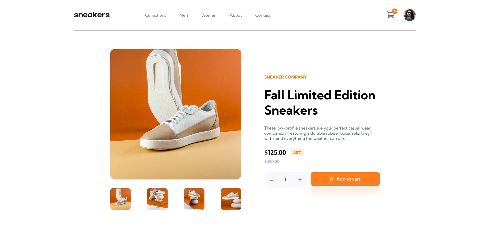

# Frontend Mentor - E-commerce product page solution

This is a solution to the [E-commerce product page challenge on Frontend Mentor](https://www.frontendmentor.io/challenges/ecommerce-product-page-UPsZ9MJp6). Frontend Mentor challenges help you improve your coding skills by building realistic projects.

## Table of contents

- [Overview](#overview)
  - [The challenge](#the-challenge)
  - [Screenshot](#screenshot)
  - [Links](#links)
- [My process](#my-process)
  - [Built with](#built-with)
  - [Continued development](#continued-development)
- [Author](#author)

## Overview

This project is about creating a product page for an e-commerce website.
It is implemented with html, css and vanilla JS (no framework). It does not have DB functionalities (for now) and it follow the guidelines of the frontend mentor challenge.
This project shows how to connect different elements to each other, develope elements dinamically with JavaScript and a pretty complex use of both HTML and CSS.

### The challenge

Users should be able to:

- View the optimal layout for the site depending on their device's screen size
- See hover states for all interactive elements on the page
- Open a lightbox gallery by clicking on the large product image
- Switch the large product image by clicking on the small thumbnail images
- Add items to the cart
- View the cart and remove items from it

### Screenshot

### Links

- Solution URL: https://github.com/PaoloVilardi/ecommerce-product-page-main/
- Live Site URL: https://paolovilardi.github.io/ecommerce-product-page-main/

## My process

### Built with

- Semantic HTML5 markup
- CSS custom properties
- Flexbox
- CSS Grid
- Javascript

### Continued development

I would like to continue this project to make a whole e-commerce website, adding DB handling and other features

## Author

- Website - [Paolo Vilardi GitHub](https://github.com/PaoloVilardi/)
- Frontend Mentor - [@yourusername](https://www.frontendmentor.io/profile/PaoloVilardi)

